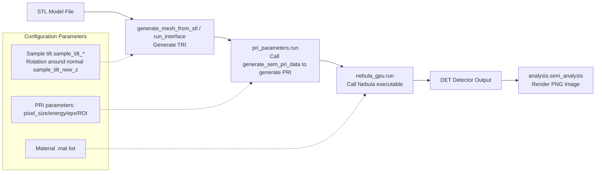

# Nebula Python Wrapper Project Documentation

## Project Overview

Nebula Python Wrapper is a collection of Python tools and scripts for running and analyzing Nebula simulations, covering geometry (TRI) generation, electron beam input (PRI) generation, Nebula executable calls, and result visualization, while also providing a convenient desktop GUI tool for "Images to Video".

Intended audience and prerequisites:
- Intended audience: Researchers and engineers engaged in experiments/simulations/software engineering
- Environment prerequisites: Python 3.9+; Linux desktop environment (for GUI); already have Nebula executable (`source/nebula_gpu`) and material `.mat` files

End-to-end workflow (overview):
1) STL → TRI: `voxel_to_mesh.generate_mesh_from_stl`/`run_interface` (tilt and rotate around normal)
2) ROI/energy etc. → PRI: `sem_pri.generate_sem_pri_data` (`pri_parameters.run` wrapper)
3) TRI + PRI + MAT → DET: `run_nebula.nebula_gpu.run()` calls executable and monitors progress
4) DET → PNG: `analysis.sem_analysis` outputs image (reusable in GUI/automatic scripts)

Simplified flowchart (Mermaid):



## Project Structure (Current)

```
nebula_python_wrapper/
├── CHANGELOG.md
├── PROJECT_DOCUMENTATION.md      # This file
├── README.md
├── TECHNICAL_DOCUMENTATION.md
├── USER_GUIDE.md
├── troubleshooting.md
├── docs/
│   └── nebula_gpu_python_wrapper_doc.md
├── requirements.txt              # Runtime dependencies (includes PyQt6, opencv-python)
├── setup.py
├── LICENSE
├── Makefile                      # Common tasks (install/format/lint/gui/sem/sim)
├── pyproject.toml                # Code style and check configuration (black/isort/ruff)
├── requirements-dev.txt          # Development dependencies (ruff/black/isort)
└── source/
   ├── __init__.py
   ├── analysis.py               # Provides sem_analysis and other analysis functions
   ├── auto_run_simulation.py    # Batch automatic simulation main script
   ├── generate_circular_mesh.py
   ├── generate_cylinder_mesh.py
   ├── generate_tri_pri.py
   ├── images_to_video_gui.py    # Images to Video GUI (PyQt6 + OpenCV)
   ├── nebula_gpu                # Nebula executable (Linux example)
   ├── nebula_gui.py             # Interactive GUI (simulation-related)
   ├── parameters.py             # tri_parameters / pri_parameters
   ├── process_stl_to_tri.py
   ├── read_stl_to_txt.py
   ├── rotate_cylinder.py
   ├── rotation_matrix.py
   ├── run_nebula.py             # nebula_gpu call and progress monitoring wrapper
   ├── save_parameters.py
   ├── sem-analysis.py           # SEM analysis script (example)
   ├── sem_pri.py                # Electron beam input (.pri) generation
   ├── tri_view_gui.py
   └── voxel_to_mesh.py          # STL/voxel to TRI generation
```

## Core Functionality

### 1. SEM Image Simulation

The project provides a complete toolchain for simulating scanning electron microscope (SEM) images:

- **Electron beam data generation**: `sem_pri.py` script generates `.pri` files containing electron beam data, simulating electron behavior on sample surfaces.
- **Mesh generation and processing**: Provides various tools to generate and process triangle meshes, including conversion from STL files, rotation and transformation of meshes, etc.
- **Detector simulation**: Simulates the process of electrons being captured by the detector after interacting with the sample, generating `.det` files.

### 2. Geometry Processing (TRI) and Detector/Environment Geometry

- STL and voxels:
   - `voxel_to_mesh.py` provides `generate_mesh_from_stl` and `run_interface`, converting STL/voxels to TRI;
   - Internally performs: scale normalization → tilt/rotate around normal → detector polygon (36-sided approximate circle) and environment enclosure construction → output TRI.
- Coding conventions (excerpts):
   - Sample triangles: `0 -123 ...`
   - Detector triangles: `-125 -125 ...`
   - Environment enclosures: `-122 -122` (walls), `-127 -127` (bottom)
- Other tools:
   - `process_stl_to_tri.py` / `read_stl_to_txt.py`: STL parsing and conversion
   - `generate_circular_mesh.py` / `generate_cylinder_mesh.py`: Basic geometry generation
   - `rotate_cylinder.py`: Rotation around axis

Material file (`.mat`) description:
- Configured in `auto_run_simulation.py` via `mat_paths_list=[Path('/path/to/silicon.mat'), ...]`
- Multiple materials concatenated with spaces and passed to executable: `... tri.pri silicon.mat pmma.mat > output.det`
- Ensure paths exist and file format meets Nebula requirements

### 3. Graphical User Interface

`nebula_gui.py` provides a PyQt6-based graphical user interface enabling users to:

- Configure Nebula GPU parameters
- Generate and process TRI and PRI files
- Visualize simulation results
- Adjust sample and detector tilt angles

Additionally, `images_to_video_gui.py` provides Images to Video GUI:
- Select/append multiple images (across folders), sort by name or date;
- Set frame rate, resolution (including custom), aspect ratio strategy (maintain/stretch), quality (high/standard/compressed);
- Encoder fallback: prioritize HEVC/H.265 (hev1), H.264 (avc1), fallback to mp4v if unavailable;
- Automatically corrects target dimensions to even numbers, improving encoding compatibility.

Performance and known limitations:
- High resolution or very long sequence video export may take considerable time; recommend selecting "standard/compressed" quality in GUI or reducing resolution
- OpenCV's HEVC/H.264 support depends on compilation options; if unavailable will fallback to `mp4v` (usually most compatible)

## Technical Details

### Electron Beam Simulation (PRI Generation)

The `generate_sem_pri_data` function in `sem_pri.py` is the core of electron beam simulation, it:

1. Generates a data structure containing electron position, direction, energy, and pixel information
2. Supports Poisson distribution of electron numbers, simulating shot noise of real electron beams
3. Supports Gaussian distribution of beam spot size
4. Optimized memory usage through batch processing of large electron data

### Mesh Processing (Coordinated with TRI Generation)

The project includes various mesh processing functions:

1. **STL to TRI conversion**: Converts standard STL files to the TRI format used by the project
2. **Mesh rotation**: Supports rotating meshes at specified angles to simulate sample tilt
3. **Detector position adjustment**: Can adjust detector position and angle to simulate different imaging conditions

### Ion Beam and Electron Beam Imaging

The project supports two main imaging modes:

1. **Ion beam imaging**:
   - Detector tilt angle typically 55 degrees or 52 degrees
   - Ion beam emission direction perpendicular to detector plane
   - Sample tilt angle typically same as detector tilt angle

2. **Electron beam imaging**:
   - Detector tilt angle is 76.8 degrees
   - Electron beam incidence direction fixed along z-axis (tilt angle 0 degrees)
   - Sample can be tilted arbitrarily

## Installation and Usage

### Installation

```bash
# Install runtime dependencies
pip install -r requirements.txt

# Optional: Development dependencies (code style/checking)
pip install -r requirements-dev.txt

# Optional: Development mode installation (provides entry scripts, see setup.py)
pip install -e .
```

### Usage

#### Command Line and Scripts

```bash
# Launch Images to Video GUI
python source/images_to_video_gui.py

# Run SEM analysis script (example)
python source/sem-analysis.py

# Run automatic simulation script (iterate through STL, generate TRI/PRI, call Nebula and export images)
python source/auto_run_simulation.py
```

auto_run_simulation common parameters (located in script header area):
- Input paths: `stl_dir` (iterate through .stl files); `nebula_gpu_path` (executable path); `mat_paths_list` (material list)
- Rotation parameters: `rotate_angle_start/stop/step`, `sample_tilt_x`, `sample_tilt_new_z`
- PRI and ROI: `pixel_size`, `energy`, `epx`; first frame `roi_array` automatically estimated based on geometry
- Output: `output_path` (.det); each frame PNG and camera parameter JSON (contains `camera` and `frames`)

#### Interactive Simulation GUI

```bash
python source/nebula_gui.py
```

#### Programming Interface (Example)

```python
# Generate SEM electron beam data
from source.sem_pri import generate_sem_pri_data

# Set parameters
z = 150                            # Starting z position (nm)
xpx = np.linspace(-128, 128, 512)  # x pixel range
ypx = np.linspace(-128, 128, 512)  # y pixel range
energy = 500                       # Electron beam energy (eV)
epx = 1000                         # Number of electrons per pixel

# Generate data
generate_sem_pri_data(z, xpx, ypx, energy, epx, file_path='data/sem.pri')

# Process STL files
from source.parameters import tri_parameters, pri_parameters
from source.run_nebula import nebula_gpu

# Generate TRI based on STL
TRI = tri_parameters(stl_path='path/to/model.stl', mesh_path='path/to/out_dir',
                     beam_type='electron', sample_tilt_x=0, sample_tilt_y=0,
                     sample_tilt_new_z=0, det_tilt_x=76.8)
v, faces, d_zmin, d_zmax, tri_file_path, R = TRI.run()

# Generate PRI based on ROI/energy etc. parameters (example)
PRI = pri_parameters(pri_dir='path/to/out_dir', pixel_size=2, energy=500, epx=500,
                     sigma=1.0, poisson=True,
                     roi_x_min=-256, roi_x_max=255, roi_y_min=-256, roi_y_max=255,
                     d_zmin=d_zmin, d_zmax=d_zmax)
pri_file_path = PRI.run()

# Call Nebula executable and output .det, then convert to image
cmd = f'"{"source/nebula_gpu"}" "{tri_file_path}" "{pri_file_path}" /path/to/materials/silicon.mat > "path/to/output.det"'
NEBULA = nebula_gpu(command=cmd, sem_simu_result='path/to/output.det', image_path='path/to/output.png')
NEBULA.run()

Tip: `run_nebula.nebula_gpu` monitors stderr and waits ~20 seconds after detecting `Progress 100.00%` for fallback termination; if still not exited, actively terminates to avoid hanging, then continues to attempt showing results.
```

## Troubleshooting

The project includes a `troubleshooting.md` file recording solutions to common problems, especially regarding module import issues.

## Dependencies

- NumPy: For numerical computations
- Matplotlib: For data visualization
- PyQt6: For graphical user interface
- OpenCV (opencv-python): For image to video encoding

Development workflow recommendations:
- Use Makefile: `make install` / `make install-dev` / `make format` / `make lint` / `make gui` / `make sem` / `make sim`
- Unified style: Configured via black/isort/ruff in `pyproject.toml`
- VS Code: Can use `.vscode/tasks.json` (currently ignored by default, adjust .gitignore if version control needed)
- Torch: For some computational acceleration

## Future Development Directions

1. **Performance Optimization**:
   - Further optimize processing of large datasets
   - Utilize GPU acceleration for more computational processes

2. **Functionality Expansion**:
   - Support more material properties and simulation parameters
   - Add more geometric shape mesh generation tools

3. **User Interface Improvements**:
   - Add real-time preview functionality
   - Provide more visualization options

4. **Documentation Completion**:
   - Add detailed API documentation for each module
   - Provide more usage examples and tutorials

## Conclusion

The Nebula Python Wrapper project provides a complete set of tools for scanning electron microscope and ion beam imaging simulation and analysis. By providing command-line tools, programming interfaces, and graphical user interfaces, this project meets the needs of different users, from researchers to engineers can conveniently use these tools for scientific research and engineering applications.
